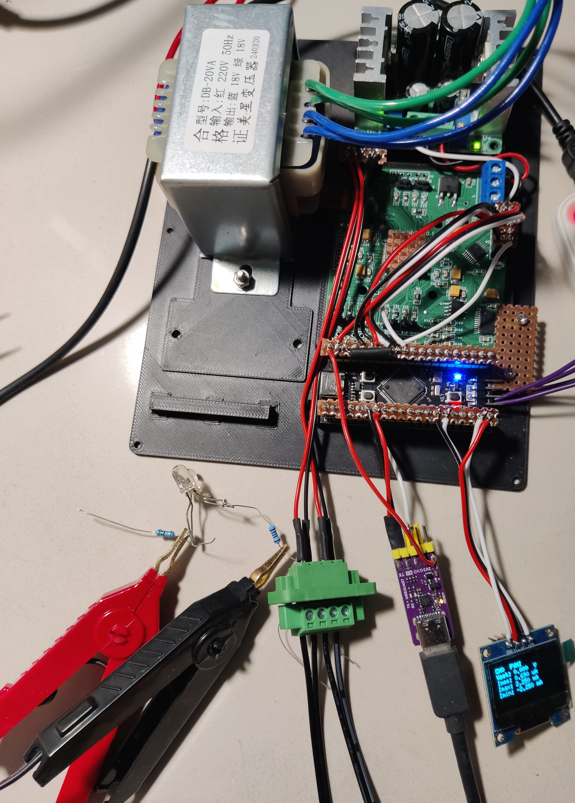
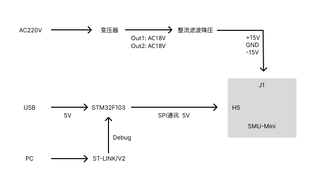
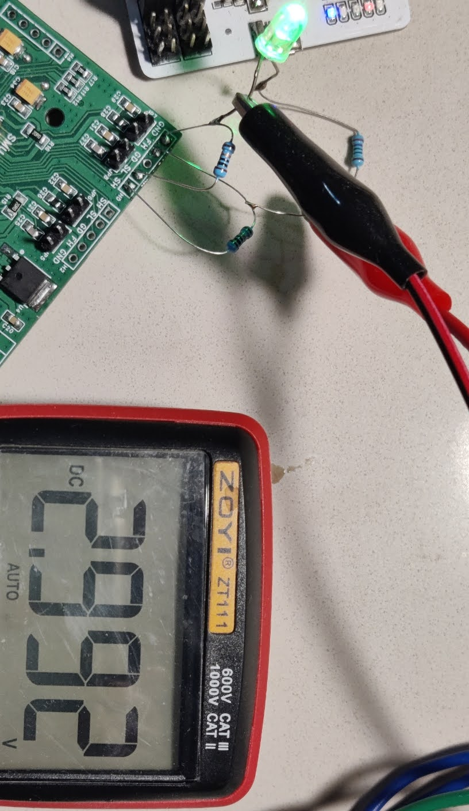

## 介绍

Quad-SMU 四通道参数测量单元

功能：

电压驱动(FV)、电流驱动(FI)、高阻输出(FN)、测量电压(MV)、测量电流(MI) 

详情参考 AD5522 芯片手册



## 方案

### 整体框架

 

F103 修改为 F401，主要是想找一块体积小的开发板。

## 硬件

SMU-Mini原理图：Document\SCH_Schematic1_2025-06-07.pdf

在 [Dave Erickson](https://www.djerickson.com/quad-smu/) 的基础上修改了 ADC 采样和通讯隔离芯片。

绿色输出端子：（左至右）

红色夹1(FH)  红色夹2(SH)   黑色夹1(GND)  黑色夹2(SL)

### 改动：

STM32 开发板：

MOSI（PA6） 通过一个 1k 的电阻连接到 ADC_READY_Pin（PB10）

## 软件

开发环境：`Windows/Linux` `VScode` `Stm32 VS Code Extension` 安装方式请参考 [st.com](https://www.st.com/content/st_com/en/campaigns/stm32-vs-code-extension-z11.html)

依赖的软件有：STM32CubeMX

在一开始编译完项目后，F5 调试提示错误，检测不到硬件。为了确定是硬件问题还是环境为设置正确，我又安装了 STM32CubeProgrammer 帮助我确定是硬件原因，而非环境设置问题。当然 Keil 也可以。

项目工程由 STM32CubeMX 打开 stm32Proj.ioc 文件生成，然后加入 Core/Src 中的其他文件。还有下面提到依赖的外部库放到 Drivers 文件夹。

在 Stm32 VS Code Extension 打开 Launch STM32CubeMX 修改 smu-mini.ioc 选择 CMake 方式重新生成项目工程后，需要在 cmake/stm32cubemx/CMakeLists.txt 中增加自行添加需要包含的 Core/Src中的 .c 源文件。 


```CMakeLists.txt
# STM32CubeMX generated application sources
set(MX_Application_Src
    ${CMAKE_CURRENT_SOURCE_DIR}/../../Core/Src/ui.c
    ${CMAKE_CURRENT_SOURCE_DIR}/../../Core/Src/ad5522.c
    ${CMAKE_CURRENT_SOURCE_DIR}/../../Core/Src/ad7190.c
    ${CMAKE_CURRENT_SOURCE_DIR}/../../Core/Src/task_adc.c
    ${CMAKE_CURRENT_SOURCE_DIR}/../../Core/Src/task_dac.c
    ${CMAKE_CURRENT_SOURCE_DIR}/../../Core/Src/scpi-def.c
    ${CMAKE_CURRENT_SOURCE_DIR}/../../Core/Src/task_scpi.c
    ${CMAKE_CURRENT_SOURCE_DIR}/../../Core/Src/main.c
    ...


...
set(CMAKE_C_FLAGS "${CMAKE_C_FLAGS} -Wall -fdata-sections -ffunction-sections -u_printf_float")
...
```

外部依赖库 在 Drivers 文件夹下

[lwrb](https://github.com/MaJerle/lwrb)：下载压缩包后将lwrb/lwrb文件夹复制到 Drivers 文件夹中

CMakeLists.txt 中增加 `add_subdirectory(Drivers/lwrb)` 和 target_link_libraries 项中增加 lwrb

[u8g2](https://github.com/olikraus/u8g2)：下载压缩包后将u8g2/csrc 文件夹复制到 Drivers/u8g2/csrc 文件夹中并增加 CMakeLists.txt 文件

```CMakeLists.txt

add_library(u8g2
        "u8g2_d_setup.c"
        "u8g2_d_memory.c"
        "u8g2_intersection.c"
        "u8g2_ll_hvline.c"
        "u8g2_setup.c"
        "u8g2_hvline.c"
        "u8g2_font.c"
        "u8g2_buffer.c"
        "u8g2_fonts.c"

        "u8g2_box.c"
        "u8g2_circle.c"
        "u8g2_polygon.c"
        "u8g2_bitmap.c"
        "u8g2_cleardisplay.c"
        "u8g2_input_value.c"
        "u8g2_line.c"
        "u8g2_kerning.c"
        "u8g2_message.c"
        "u8g2_selection_list.c"


        "u8x8_gpio.c"
        "u8x8_setup.c"
        "u8x8_display.c"
        "u8x8_cad.c"
        "u8x8_byte.c"
        # "u8x8_fonts.c"

        "u8x8_string.c"
        "u8x8_display.c"
        "u8x8_8x8.c"
        "u8x8_capture.c"
        "u8x8_debounce.c"
        "u8x8_message.c"
        "u8x8_selection_list.c"
        "u8x8_input_value.c"
        "u8x8_u8toa.c"
        "u8x8_u16toa.c"

        "u8x8_d_ssd1306_128x64_noname.c"
        )
target_include_directories(u8g2 PUBLIC ${CMAKE_CURRENT_SOURCE_DIR})
```

[libscpi](https://github.com/j123b567/scpi-parser/tree/master) 

直接通过 VScode 的 CMake 插件编译和调试工程。

## 进度

### 已完成

* Stm32 和 AD7190 通讯，可以读取到 AD7190 AIN1 对 AINCOM 的 AD 值。

* 依次与 AD5522 和 AD7190 两个芯片通讯

* 串口 DMA 接收功能

* 接入 SCPI 库，指令接收与返回

SCPI 库的 libscpi/inc/scpi/config.h 使用 `#define SCPIDEFINE_doubleToStr(v, s, l) snprintf((s), (l), "%.15lg", (v))` 做浮点转换，但生成的项目工程默认禁用浮点功能，需要修改文件cmake/gcc-arm-none-eabi.cmake ，增加 ` -u_printf_float`. 编译后的 ROM 增加了 4912B.

`set(CMAKE_C_FLAGS "${CMAKE_C_FLAGS} -Wall -Wextra -Wpedantic -fdata-sections -ffunction-sections -u_printf_float")`

增加自定义 SCPI 指令控制 AD5522 芯片

* SCPI 通讯任务和 AD7190 任务均会使用 SPI1，所以使用互斥信号量，保护共享资源。

* 可在[上位机软件](https://github.com/yyii-site/smu-mini-qml)通过SCPI指令设置 CH0 的目标电压，读取 AD7190 的测量值



### 待开发

踩坑记录 Document/README_CN.md

* 提高与 AD5522 和 AD7190 芯片通讯效率

* 完善与上位机通讯

* 校准


## 感谢

https://www.djerickson.com/quad-smu/

https://github.com/zifangzhao/PMU_controller/blob/H7A3/Core/Src/AD5522.c

https://github.com/msthrax/AD7190/tree/master

[STM32串口DMA发送&接收](https://github.com/MaJerle/stm32-usart-uart-dma-rx-tx) 配合 lwrb 库实现中断接受，任务处理。

https://github.com/j123b567/scpi-parser
